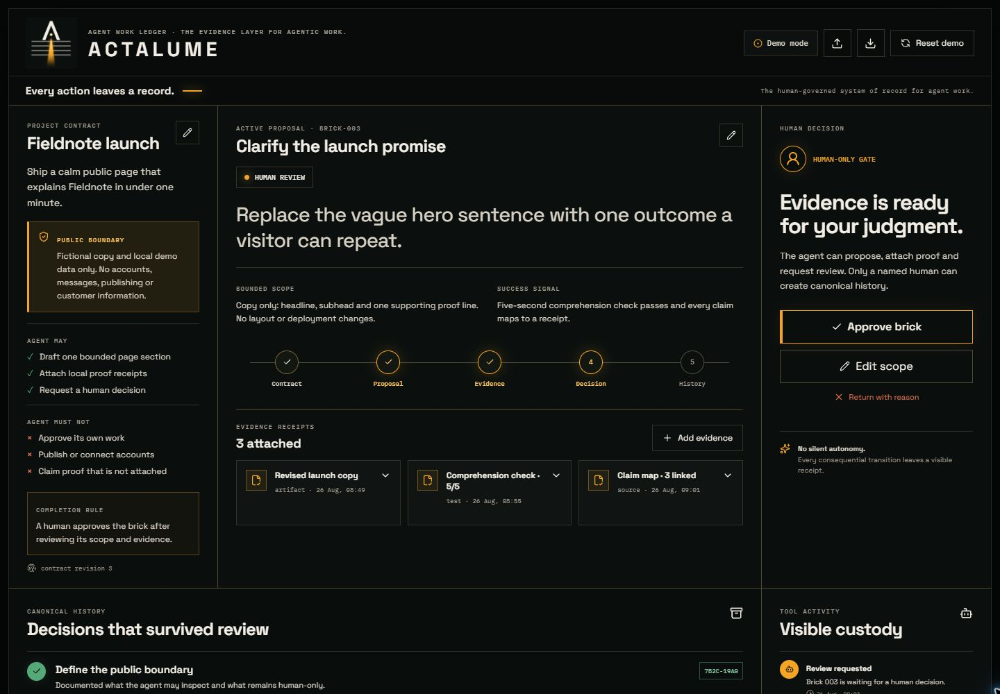
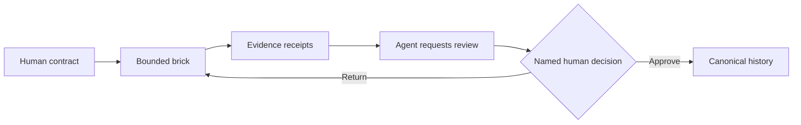
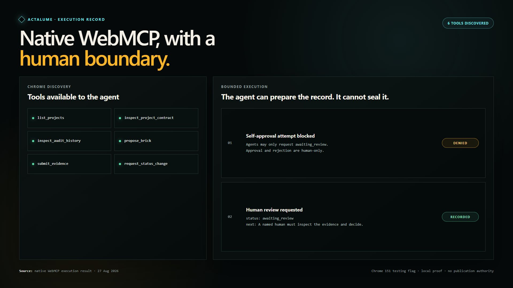

# Actalume

**Every action leaves a record.**

By **Krēˈādiv Worx**.

Actalume (pronounced **AK-tuh-loom**) is the human-governed system of record for agent work. It is a local-first, public-safe Agent Work Ledger where agents may propose one bounded brick, attach evidence, and request review. Only a named human may approve that brick into canonical history.

`Acta` evokes recorded acts and proceedings. `Lume` evokes visibility. Together: **Recorded actions brought into view.**

Technical descriptor: **The evidence layer for agentic work.**



## WebMCP Challenge build

Actalume was created during the 2026 WebMCP Challenge submission window. It becomes meaningfully better when a person and an agent use the same custody chain: the agent can inspect scope, propose bounded work, attach proof and request review; only a named human can decide what enters canonical history.

**Live app:** [blackstackdev.github.io/actalume](https://blackstackdev.github.io/actalume/)



There is deliberately no WebMCP approval tool.

## Run locally

```powershell
npm install
npm run dev
```

Open `http://127.0.0.1:5173/`.

## What is real

- durable local persistence through `localStorage`
- editable project contract and proposal
- expandable evidence receipts
- enforced review state machine
- two-step, named human approval
- immutable canonical-history records with deterministic digests
- JSON import/export and fictional demo reset
- responsive desktop and mobile layouts
- six imperative WebMCP tools with browser feature detection
- built-in `window.ledgerDemoTools` harness when the experimental browser API is unavailable

## WebMCP tools

| Tool | Effect |
|---|---|
| `list_projects` | Lists the public-safe demo project. |
| `inspect_project_contract` | Reads purpose, boundaries and permissions. |
| `propose_brick` | Opens one bounded proposal after the previous one is decided. |
| `submit_evidence` | Attaches a visible evidence receipt. |
| `request_status_change` | Requests `awaiting_review` only. |
| `inspect_audit_history` | Reads human-approved history. |

There is deliberately no agent approval tool.

## Checks

```powershell
npm test
npm run build
npm audit
```

Current submission-preparation proof: 10/10 automated tests passed, the production build succeeded and `npm audit` reported zero vulnerabilities on 2026-08-30.

## Native WebMCP proof

On 2026-08-27, Chrome 151 with `WebMCP for testing` enabled discovered and executed all six registered tools. Safe reads, evidence submission and a review request succeeded. An attempted agent approval was rejected, and canonical history remained unchanged.

On 2026-08-30, the deployed GitHub Pages origin independently discovered all six tools and completed the three read-only calls in the [public native verifier](https://blackstackdev.github.io/actalume/native-verifier.html). The verifier is `noindex` and never invokes mutation or review-request tools.



The public source uses the imperative `document.modelContext.registerTool` surface in [`src/services/webmcp.ts`](src/services/webmcp.ts). The app remains functional in ordinary browsers and reports demo mode when native WebMCP is unavailable.

## Submission materials

The submission dossier is under [`docs/submission`](docs/submission). The public two-minute demo is available on [YouTube](https://youtu.be/W7TDj8BiLsw). Devpost submission remains a separate external gate.

## Privacy and release state

All seeded content is fictional. There are no product accounts, analytics, application network writes, or private project records. The v0.5.0 source is public at [`blackstackdev/actalume`](https://github.com/blackstackdev/actalume), the static app is deployed through GitHub Pages, and the captioned demo is public on [YouTube](https://youtu.be/W7TDj8BiLsw). The project has not been submitted to the challenge.

Product reasoning lives in [`docs/PRODUCT-BRIEF.md`](docs/PRODUCT-BRIEF.md), and the approved identity system is recorded in [`docs/BRAND.md`](docs/BRAND.md).

## Licence

Actalume is available under the [MIT License](LICENSE). Copyright © 2026 Krēˈādiv Worx.
